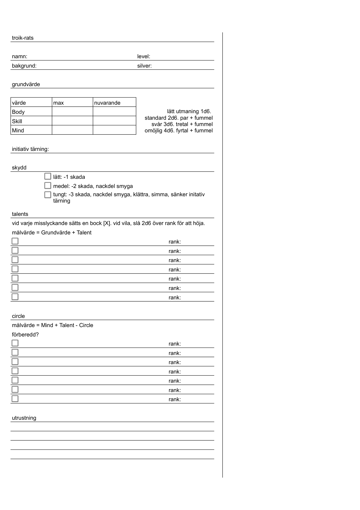

## Innehållsförteckning

### **I. Spelets grunder**
* [# Grundregler](#grundregler) – *2d6-systemet, Par & Fummel*
* [## Grundvärde](#grundvärde) – *Body, Skill och Mind*
* [# Svårighetsgrad](#svårighetsgrad) – *Tärningspooler och utmaningar*
* [# Motståndarens grundvärde](#motståndarens-grundvärde-är-lite-annorlunda) – *Brawn, Special och Moral*
* [# Death-Spiral](#death-spiral-när-grundvärde-minskar) – *Konsekvenserna av att ta skada*

### **II. Karaktärsegenskaper**
* [# Talents](#talents) – *Hur talanger fungerar och beräknas*
* [## Tabell med Talents](#tabell-med-talents) – *Snabbguide till alla färdigheter*
* [## Beskrivning av Talents](#beskrivning-av-tabell-med-talents) – *Detaljerade förklaringar*

### **III. Strid & Överlevnad**
* [# Initiativ](#initiativ) – *Turordning baserat på Skill*
* [# Strid](#strid) – *Motståndsslag och anfall*
* [## Kreativ strid & grupper](#kreativ-strid) – *Vinnarens vilja och numerärt överläge*
* [## Skada och skydd](#skada-och-skydd) – *Rustning och hälsa*
* [## Vapen](#vapen) – *Vapentabeller för närstrid och distans*
* [# Motståndare](#motståndare) – *Bestiarium och HD-värden*
* [## Att möta Giganter](#att-möta-giganter-hd-3) – *Strategier mot monster med HD 3+*

### **IV. Det övernaturliga**
* [# Magi](#magi) – *Grunderna i magiska krafter*
* [## Circles](#circles) – *Kraftnivåer från 0 till -5*
* [## Circle Talents](#circle-talents) – *De magiska skolorna*
* [# Besvärjelser och trollformler](#besvärjelser-och-trollformler-circles) – *Lista över magi per cirkel*
* [# Mutationer](#mutationer) – *När kroppen förändras*
* [# Fummel tabeller](#fummel-tabeller) – *Katastrofer och mutationstabell*
---
* [Karaktärsblad](troik-ratsChar.png)
---
_Länkar till ytterligare regler_
* [Utrustning](utrustning.md)
* [Fördjupa din karaktär](fördjupa.md)
* [Startkaraktärer med Talents](startbakgrund.md)
* [Råttvakt, en nybörjarstad](rattvakt.md)
* [Varför håller ni ihop?](varförHåller.md)
---
# Grundregler
För att se om du klarar en utmaning (om det ej är en utmaning kan man se det som att man automatiskt lyckas) rullar du två sexsidiga tärningar, även kallat 2d6 eller 2t6. Detta är en standard utmaning. Slår du under eller på målvärdet lyckas du. Är det en utmaning eller tävling mot en motståndare vinner den som lyckas slå under sitt värde. Skulle båda lyckas vinner den med högsta summan.

**Slår du ett par** är betyder det att du **kritisk lyckas med din utmaning** oavsett om du kom under ditt värde eller inte. Det kan resultera i dubbel skada, något annat fantastiskt bra händer eller bara att utmaning lyckades. Vid standard utmaning är det alltid 13,9% chans!

Undantaget från att ett par är bra är **när du får sexor (6, 6)**. Detta är istället en **fummel och är ett fruktansvärt misslyckades**. Vilket kan bli så att fienden gör dubbel skada, du gör skada på dig själv eller en allierad eller magin orsakar mutationer eller katastrofer. Risken att få två sexor vid standard utmaning är 2,8%.

> Skulle det vara två par där den ena är fummel och den andra är kritisk lycka, vinner alltid fummel.

När omständigheterna ger dig en tydlig fördel eller nackdel slår du **en extra d6** än vad utmaningen kräver.

* **Fördel:** Behåll de **lägsta** tärningarna som utmaningen kräver.
* **Nackdel:** Behåll de **högsta** tärningarna som utmaningen kräver.

## Grundvärde
En spelare har tre grundvärden. De heter **Body, Skill och Mind**. Så här kan man enkelt bryta ner betydelsen av grundvärde:
* **Body** = Hälsa = Styrka 
* **Skill** = Smidighet = Rörelse = Fingerfärdighet = Hantverk
* **Mind** = Mental hälsa = Magi = Språk = Kunskap

> En ny karaktär börjar med att sätta 5, 6 och 7 på varsitt grundvärde.

# Svårighetsgrad

När du står inför en utmaning där du definitivt klarar uppgiften så klarar du det automatiskt. Skulle det vara något svårare är det dags att använda Svårighetsgraderna. För varje steg av svårighet ökar antalet d6 tärningar du får använda.

- **Lätt utmaning** använder du **1d6** och försöker nå ditt målvärde eller under. Här **går det inte att få par eller fummla.**
- **Standard utmaning och vanlig strid** använder du **2d6** och försöker nå ditt målvärde eller under.  Här **kan du få ett par eller fummla.**
- **Svår utmaning** använder du **3d6** och försöker nå ditt målvärde eller under. Här behövs **tre av samma för att få en kritisk framgång, fummel kräver bara två sexor (6, 6)**.
- **Omöjlig utmaning** använder du **4d6** och försöker nå ditt målvärde eller under. Här behövs **fyra av samma för att få en kritisk framgång, fummel kräver bara två sexor (6, 6)**.

> Genom planering, använda lämpliga Talents, lämplig utrustning m.m. av spelaren kan spelledaren gå med på att sänka utmaningen eller ge en fördel.

# Motståndarens grundvärde är lite annorlunda
Motståndaren använder en annan terminologi för att särskilda dem från spelare. De använder även Hit Die vilket är antal 6 sidiga tärningar som summeras för att representera svårighetsgraden som motståndare. Motståndare använder då dessa istället: 
* **Brawn** = Hälsa = Styrka = Smidighet = Rörelse
* **Special** = Skill = Mind = Magi = Fingerfärdighet = Språk = Kunskap
* **Moral** = Mental hälsa = Hur länge de vågar vara i striden

Moralen sjunker när någon dör i gruppen. När de nått hälften av sin moral testas en standard utmaning (2d6 med målvärde prick eller under) med moralen som sitt målvärde. Lyckas utmaningen stannar de kvar i striden.

# Death-Spiral när grundvärde minskar
Body och Mind minskar när grundvärdet tar skada och det resulterar i att målvärdet minskar tillsammans och gör det svårare att lyckas. Detta kallas Death-Spiral och gör dig svagare ju längre tid du är i striden. Du vill alltså avsluta det snabbt.

# Talents
Talents eller talanger representerar din specifika träning och erfarenhet. Vid nivå 1 har du **6 poäng** att fördela på dina Talents (max 6 i en enskild Talent).
När du använder en Talent adderar du dess värde till ditt grundvärde (**Body, Skill** eller **Mind**) för att få ditt **målvärde**. Det är detta totala värde du ska slå under med 2d6.

> Exempel
> * **Body:** Strid, Slåss, Skrämma, Styrkeprov.
> * **Skill:** Smyga, Stjäla, Skjuta, Hantverk, Akrobatik, Matlagning.
> * **Mind:** Magi, Historia, Hela, Argumentera, Naturkännedom, Skrämma.

> Vid nivå 1 delar du ut **6 poäng** på dina Talents.

## Tabell med Talents

| d6 | 1 | 2 | 3 | 4 | 5 | 6 |
| :--- | :--- | :--- | :--- | :--- | :--- | :--- |
| **1 (Body)** | Strid | Slåss | Skrämma | Styrkeprov | Bärsärk | Klättra |
| **2 (Body)** | Simma | Uthållighet | Akrobatik | Provocera | Byggnad | Grovarbete |
| **3 (Skill)** | Smyga | Stjäla | Skjuta | Dölja | Fällor | Hantverk |
| **4 (Skill)** | Fingerfärdig | Matlagning | Djurtämjare | Sikta | Dans | Navigera |
| **5 (Mind)** | Magi | Hela | Historia | Argumentera | Natur | Språk |
| **6 (Mind)** | Värdera | Spåra | Välsignelse | Etikett | Kasino | Melodi |

### Beskrivning av tabell med Talents
#### **Body-baserade**

* **Strid:** Effektivt användande av svärd, yxor och närstridsvapen.
* **Slåss:** Handgemäng, knytnävar och oortodoxa krogmål.
* **Skrämma:** Att använda sin fysiska storlek eller hotfullhet för att få sin vilja igenom.
* **Styrkeprov:** Bryta upp dörrar, lyfta fallgaller eller flytta tunga stenar.
* **Bärsärk:** Att kanalisera vrede för att ignorera smärta eller öka sin kraft.
* **Klättra:** Ta sig uppför lodräta ytor, riggar eller stadsmurar.
* **Simma:** Förmågan att inte drunkna i tunga rustningar och korsa vattendrag.
* **Uthållighet:** Att motstå gifter, extrem utmattning eller svält.
* **Akrobatik:** Balansgång på hustak och att landa mjukt efter ett hopp.
* **Provocera:** Att få fienden att tappa fattningen och attackera dig istället för dina vänner.
* **Byggnad:** Att snabbt resa skydd, barrikader eller reparera vagnar.
* **Grovarbete:** Allmän kroppslig händighet och kunskap om gruvor/byggen.

#### **Skill-baserade**

* **Smyga:** Konsten att inte höras eller synas i skuggorna.
* **Stjäla:** Lätta fickor och att knycka föremål mitt framför näsan på folk.
* **Skjuta:** Prickskytte med båge eller armborst.
* **Dölja:** Att gömma föremål på kroppen eller maskera spår av smuggling.
* **Fällor:** Att konstruera dödliga fällor eller desarmera dem man stöter på.
* **Hantverk:** Finlir med trä, läder eller metall för att laga utrustning.
* **Fingerfärdighet:** Att dyrka lås och utföra imponerande trick med händerna.
* **Matlagning:** Att förvandla ruttna rester till en måltid som läker Body eller Mind.
* **Djurtämjare:** Att få vilddjur att lyda eller lugna rädda hästar.
* **Sikta:** Att kasta knivar, stenar eller flaskor med precision.
* **Dans:** Att imponera på hovet eller distrahera en vakt med graciösa rörelser.
* **Navigera:** Att hitta vägen i vildmarken eller styra en farkost genom storm.

#### **Mind-baserade**

* **Magi:** Kunskapen att läsa grimoirer och kanalisera kosmiska krafter.
* **Hela:** Förbinda sår, stoppa blödningar och kurera sjukdomar.
* **Historia:** Att känna till gamla kungar, ruiner och bortglömda legender.
* **Argumentera:** Att vinna diskussioner genom logik, lögner eller retorik.
* **Natur:** Att veta vilka svampar som dödar och hur man överlever i skogen.
* **Språk:** Att läsa utdöda språk och förhandla med främmande kulturer.
* **Värdera:** Att snabbt se skillnad på äkta guld och förgyllt bly.
* **Spåra:** Att tolka brutna kvistar och fotspår för att hitta sitt mål.
* **Välsignelse:** Att genom tro eller ritualer skänka hopp (eller otur).
* **Etikett:** Att veta exakt hur man tilltalar en greve eller en maffialedare.
* **Kasino:** Konsten att fuska i tärning, räkna kort och vinna i spel.
* **Melodi:** Att spela instrument eller sjunga för att styra andras känslor.

# Initiativ
Ditt initiativ avgör vem som handlar först i strid och hur snabb du är. Initiativet baseras på ditt **Skill-värde**.
**Så här fungerar det:** Ditt Skill-värde översätts till en tärning. Om ditt värde ligger mellan två tärningssteg avrundar du nedåt till närmaste tärning men får **+1** på resultatet.

> Exempel
> + Skill 5 ➡️ Initiativ d4+1
> + Skill 6 ➡️ Initiativ d6
> + Skill 7 ➡️ Initiative d6+1
> + Skill 12 ➡️ Initiativ d12
> + Skill 13 ➡️ Initiative d12+1

När alla har sina svar så börjar den med högst siffra.

# Strid
Strid här är intensivt och dödligt. Man turas om att agera baserat på **Initiativ**, men varje attack är en tävling där båda parter riskerar att ta skada.

## Så går en attack till

När du anfaller en fiende (eller fienden anfaller dig) gör ni ett **Motståndsslag**.

1. **Välj Talent:** Spelaren väljer en passande Talent (oftast **Strid** eller **Slåss**) och adderar sitt grundvärde (**Body**). Detta är spelarens målvärde.
2. **Motstånd:** Fienden använder sitt värde (t.ex. **Brawn**).
3. **Slå 2d6; Standard utmaning:** Båda slår samtidigt.

   * För att vinna måste du slå **ditt målvärde eller under** men **högre än motståndaren**.
   * Om båda lyckas slå under sina värden vinner den som slog **högst summa**.
   * **Vinnaren gör skada:** Den som vinner stridsrundan slår sin vapenskada.

> **Exempel:** Du har Body 7 + Strid 2 (Målvärde 9). En Ork har Brawn 6. Du slår en 7:a (Lyckat!). Orken slår en 5:a (Lyckat!). **Resultat:** Eftersom din 7:a är högre än Orkens 5:a (och båda är under sina målvärden) vinner du och hugger Orken!

## Kreativ strid

Strid handlar inte bara om vapen. Du kan välja att använda andra Talents för att få din vilja igenom:

* **Skrämma:** Få fienden att tveka eller fly.
* **Akrobatik:** Manövrera dig till en bättre position eller undvika att bli omringad.
* **Populär:** Kanske känner fienden igen dig och vill inte slåss, eller så börjar publiken kasta sten på din motståndare.
* **Vinnarens vilja:** Den som vinner motståndsslaget "får igenom sin vilja". Om du använde _Skrämma_ och vann, flyr fienden istället för att ta skada.

## Grupper och numerärt överläge

Att slåss mot flera är livsfarligt.

* **Gäng:** Om flera fiender attackerar samma mål på samma sätt får de **+1 på sitt målvärde, tärningsresultat och skadan** för varje extra medlem i gruppen. Skadan går först till de svagaste. Överbliven skada går till 
* **Moral:** När en kamrat faller eller blir medvetslös drabbas resten av laget av **-2 på Mind/Moral** på grund av chocken.

> Exempel på attack i grupp
> 
> Spelaren har rekryterat 5 extra medlemmar, kanske överdrivet men kontot hade råd. Hon möter 2 modifierade zombies med 10 i Brawn. Zombien attackerar med sin vän och spelaren med sina kupaner.
> 
> Spelaren har målvärde 8 och får nytt målvärde 8 + 5 (för medlemmarna som gör samma attack) = 13.
> 
> Modifierade zombien har målvärde 10 och får nytt målvärde 10 + 1 (för medlemmen som gör samma attack) = 11.
> 
> Rullar för standard utmaning 2d6. Endast här kan du få reda på om du lyckas eller misslyckas.
> 
> Spelaren får 10 (lyckas) och zombien 7 (lyckas). Därefter läggs gängbonusen på.
> 
> Spelaren får 10 + 5 = 10 och zombien får 7 + 1 = 8
> 
> Spelaren vann striden och delar ut sin skada + gängbonusen (+5) till den svagaste zombien.
## Skada och skydd

När du vinner en stridsrunda slår du din vapenskada (t.ex. 1d6 för ett svärd) och subtraherar motståndarens Body/Brawn med resultatet.

* **Skydd:** Fienden (eller du) drar av sitt Skyddsvärde från skadan.

  * _Lätt skydd:_ -1 skada.
  * _Medel skydd:_ -2 skada och nackdel när du smyger.
  * _Tungt skydd:_ -3 skada och nackdel när du smyger, klättrar och sänker initiativ tärningen med en hel tärning.

* **0 Body/Brawn:** När hälsan når 0 faller man till marken, medvetslös och döende. En allierad måste rädda dig!

## Vapen

| Närstridsvapen  |  Beskrivning | Skada |
|---|---|--|
|  Lätta vapen |  Dolk, kortsvärd, hammare, lie, rapier | 1d4+1 |
|  Medel vapen (1-2 händer) |  Spjut, långsvärd, spikklubba, yxa, stridsstav | 1d6 |
|       Tunga vapen (2 händer)       |  Halberd, Maul, storsvärd, storyxa | 1d6+2 |
|                  Slåss med nävarna                  |                  Mör och Bult vill möta ditt ansikte, snabbt                  |    1d4   |

|  Distansvapen |  Beskrivning |  Skada |
|---|---|---|
|  Lätta och nära vapen |  Slunga, hand-armborst, kortbåge |  1d4+1 |
|  Medel distans |  Långbåge, armborst, sp |  1d6 |

# Magi

Magi är kraftfullt men riskerar utövarens sinne. Det kräver fokus, tid och ibland en gnutta tur för att inte slå helt fel. Magin delas upp i sex **Circles**, där Circle -5 är den mest kraftfulla och svåra, och Circle 0 är där nybörjare härjar. När du utvecklas inom Mind har du bättre möjlighet att lyckas med lägre Circles. Att nå **Circle -5** innebär att du har bemästrat de djupaste och svåraste hemligheterna.

## Circles

Ditt värde i en **Circle** läggs ovanpå ditt **Mind**-värde för att skapa ditt målvärde.
* **Circle 0:** Ytterst lätt magi. Skadan du kan göra är 1.
* **Circle -1:** Manipulerande magi, om än något kort. Max 60 sekunder.
* **Circle -2:** Framkallande magi introduceras. Kan göra 1d4+1 i skada.
* **Circle -3:** Omgivningspåverkande magi, kallas även AoE (Area of Effect). 1d4+2 skada. Max 5 min.
* **Circle -4:** Medelstark magi och börjar bli okontrollerbar. 1d6 skada. Max 60 min.
* **Circle -5:** Svår och farlig magi. 1d8 skada. Stora områden eller permanenta effekter.

> Du kan alltid välja att kasta en formel från en högre Circle (t.ex. använda din kraft från Circle -5 för att kasta en Circle 0-formel) för att göra det enklare att lyckas. Då skalas resultatet enhetligt också. Detta kallas också skala ner på trollformlen. I vissa fall kan spelledaren tillåta att skala upp trollformlen också, men det händer mycket sällan.

### Circle Talents
För att underlätta utspottandet av trollformler och besvärjerlser kan du ha Talents i vissa magiska skolor.
- **Abjuration = Beskydd:** Skapar sköldar, bannlyser spöken och häver förbannelser
- **Conjuration = Frammaning:** Förflyttar föremål eller kallar på varesler från andra dimensioner.
- **Divination = Spå:** Ger insikt om framtiden, finner dolda sanningar och borttappade saker.
- **Enchantment = Förtrollning:** Påverkar andras sinnen, känslor och vilja. Kan även påverka fysiska saker.
- **Evocation = Framkallning:** Framkallar eld, blixtar, ljus, vatten och andra element.
- **Illusion:** Skapar skenbilder, ljud och annat som lurar sinnena.
- **Necromancy = Nekromanti:** Manipulerar liv och död, prata med andar eller väcka döda.
- **Transmutation = Förvandling:** Ändrar fysiska egenskaper hos föremål eller varelser.

> Exempel
> Spelaren vill förflytta en nyckel som finns på högsta bokhyllan. Hon använder Circle 0 Liten knuff och lägger ihop sin Mind (5) + Talent inom Frammaning (1) + Circle 0 och får sitt målvärde 6. Hon rullar 2d6 för standard utmaning och får 2 + 3 = 5. Hon lyckas med att knuffa ner nyckel så de kan gå vidare genom dörren.

## Att kasta en trollformel

Det finns två sätt att hantera magi:

1. **Förberedda formler:** Du kan förbereda upp till **två formler** i förväg. Detta tar 1 timme per formel och kräver ett lyckat slag mot trollformelns målvärde. Om du lyckas har du formeln "redo" och kan kasta den närsom utan att behöva slå tärning igen.
2. **Spontan magi:** Om du vill kasta en formel som inte är förberedd, måste du slå vanlig standard utmaning **2d6 under Mind + Circle** mitt i stridens hetta. Misslyckande åstakommer ingenting (eller värre – se Fummel).

## Fummel & Katastrofer

Magi är en instabil kraft.

* **6,6 :** Om du rullar två sexor när du kastar eller förbereder magi, drabbas du eller någon av en **Mutation**.
* **Katastrof:** Vid särskilt grova misslyckanden (eller om spelledaren anser att situationen är kaotisk, som vid Circle -4 och Circle -5) kan magin orsaka en **Katastrof** som påverkar hela omgivningen.

# Erfarenhet & Utveckling

Här blir du bättre genom att misslyckas och lära dig av dina misstag.

## Att bli bättre på Talents

Varje gång du **misslyckas** med ett slag för en **Talent**, får du sätta en **bock** i rutan för den talangen på ditt karaktärsblad. Du kan bara ha en bock per Talent åt gången.
Vid en vila på minst 8 timmar kan du försöka höja dina värden:

1. Välj en Talent du har en bock i.
2. Slå **2d6**.
3. Om resultatet är **ÖVER** din nuvarande rank i den talangen, höjs ranken med +1.
4. **Kritisk framgång (Par):** Om du slår ett par som lyckas höja din Talent, ökar även ditt tillhörande grundvärde (**Body, Skill** eller **Mind**) med +1!
5. Sudda sedan ut bocken.

## Att levla upp (Nivåer)

Din nivå (Level) bestäms av hur många poäng du har i dina **Talents** och lagt till någon av grundvärdena.

* **Level 1:** Du startar med 6 poäng totalt fördelat på dina **Talents**.
* **Level 2:** Du når nivå 2 när du har ökat dina sammanlagda poäng till 7.
* Varje gång din totala summa poäng i **Talents** ökar, kommer du närmare nästa nivå.

## Magisk utveckling (Circles)
Magiska trollformler och besvärjelser kan inte bli bättra så som Talents kan. Istället får du lära dig nya genom att hitta magiska böcker eller lärda magiker som är villiga att lära ut till ett pris. Däremot kan en magisk Talent bli bättre.

# Att må bättre och inte
## Vila

Att överleva i en fientlig värld kräver vila, men trygghet är en lyx.

* **Kort vila (8h):** Du återfår hälften av dina förlorade poäng i **Body** och **Mind**.

* **Långvila (48h):** Du återfår alla poäng i **Body** och **Mind** till ditt maxvärde.

## När krafterna sinar

* **0 Body / Brawn:** Du faller samman, medvetslös och förblödande. Om ingen stabiliserar dina sår dör du inom kort (spelledaren avgör hur många minuter du har kvar).

* **0 Mind / Moral:** Ditt psyke brister. Du drabbas av total panik, katatoni eller flyr hals över huvud. Du är ospelbar och i händerna på ödet tills du återfått minst 1 poäng **Mind**.

* **-4 Body / Brawn / Mind / Moral:** Du dör på fläcken. Ingen återvändo.

## Döden

Döden är slutgiltig i **Troik-Rats**. Om en karaktär lämnas medvetslös på slagfältet utan hjälp, eller om skadan som tog dig till under -4 var extrem (t.ex. ett fall från en flygande pråm eller en direktträff av en eldboll), dör karaktären omedelbart.

# Motståndare

Enklare strid är HD 1d4. Standard strid är HD 1d6.

|  HD (hit die) | Exempel          | Brawn (HP/Målvärde) | Special | Init-Tärning | Skada |
| --: | :------------------------- |:-----------------:| -------------- | ------------ | ----- |
| 0.5 | Råtta, Vätte, Kobold       | 1-3               | 4              | d4           | 1d2   |
|   1 | Ork, Människa, Varg        | 1-6               | 6              | d6           | 1d6   |
|   2 | Elitsoldat, Björn          | 2-12              | 8              | d6           | 1d6+1 |
|   3 | Ogre, Riddare, Ond Magiker | 3-18              | 10             | d8           | 1d6+2 |
|   4 | Jätte, Liten drake         | 4-24              | 11             | d10          | 1d6+3 |
|  5+ | Boss, Drake, Demon; naturkatastrof | 5-30      | 12+            | d10/d12      | 2d6   |

## Problem vid Brawn 12
Det finns ett stort problem med Brawn 12 och det är att de lyckas alltid slå under sitt målvärde. Däremot kan den misslyckas vid en fummel. Men chanserna ser inte bra ut. Taktik, väl planerade Talents och utrustning krävs för att underlätta sådana strider. 

## Att möta Giganter (HD 3+)

Stora monster är ofta för starka för att möta i öppen strid. Spelledaren får gärna att använda följande enkla principer:

- Sårbarhet: Monstret har ett Skydd som bara kan ignoreras om spelarna utnyttjar en svaghet (t.ex. "slåss i vatten" eller "anfall underifrån").
- Delmål: Genom att lyckas med en specifik Talent (t.ex. Klättra, Distrahera eller Melodi) kan spelarna permanent sänka monstrets Brawn eller Special med 1d6.
- Grymt slut: När ett massivt monster når 0 Brawn dör det inte alltid direkt – det kanske gör ett sista, desperat utfall eller raserar hela lyan.
- Det går också att dela in olika kroppsdelar i zoner för att underlätta för spelaren. Om draken med 24 Brawn totalt har 6 Brawn i svansen går det för en vanlig spelare att vinna över svansen. Ett till tips är att få attacker att ladda upp sig i någon runda tills attacken utlöses. Då hinner spelarna planera och agera.

Eftersom dessa katastrofer inte är enkla att ha att göra med, skickar jag med ett tips: armeér.

# Besvärjelser och trollformler (Circles)
### **Circle 0: Gatu-magi**

_Målvärde: Mind + 0. Skada: 1. Varaktighet: 15 sekunder._
* **Gnista (Evocation):** Tänder en eld, ett ljus eller ger en fiende en smärtsam stöt (1 skada).
* **Synvilla (Illusion):** Skapar ett kort ljud eller en lukt (t.ex. doften av ruttet kött eller ljudet av fotsteg).
* **Liten knuff (Conjuration):** Flyttar ett föremål som väger mindre än en råtta upp till 5 meter.
* **Budskap (Divination):** Viska ett meddelande till en person du kan se; ingen annan hör det.

### **Circle -1: Manipulatören**

_Målvärde: Mind - 1. Skada: 1d2. Varaktighet: 60 sek._
* **Vänskap (Enchantment):** En varelse blir vänligt inställd till dig så länge du inte hotar den. Men kan förstå efteråt vad som hände.
* **Skuggslöja (Illusion):** Du blir svår att se i mörker (Ger fördel på _Smyga_).
* **Dödskyss (Necromancy):** Suger musten ur offret (1d2 skada), du återfår 1 poäng Body.
* **Låsdyrk (Transmutation):** Formar om en metallbit till en fungerande nyckel för ett specifikt lås.

### **Circle -2: Framkallaren**

_Målvärde: Mind - 2. Skada: 1d4+1. Varaktighet: 1 strid/5 min._
* **Råttsvärm (Conjuration):** Kallar fram en svärm råttor som biter en fiende (1d4+1 skada).
* **Sköld (Abjuration):** En magisk barriär ger -1 på all inkommande skada i 5 min.
* **Hela sår (Abjuration):** Sluter djupa sår och läker 1d4+1 Body.
* **Levitera (Transmutation):** Målet svävar sakta upp till 3 meter upp i luften.

### **Circle -3: Kraften (AoE)**

_Målvärde: Mind - 3. Skada: 1d4+2. Varaktighet: 5 min._
* **Eldstöt (Evocation):** En våg av eld träffar alla framför dig (AoE, 1d4+2 skada).
* **Sömn (Enchantment):** 1d6 små varelser (eller 1 stor) faller i djup dvala i 5 minuter. Mottagaren får lov att försöka motstå.
* **Tala med döda (Necromancy):** Frammanar anden från ett lik för att ställa tre frågor. Anden är sällan glad.
* **Dimridå (Conjuration):** En tjock, magisk dimma täcker ett område. Alla inuti har nackdel på att försöka orientera sig, hitta eller sikta.

### **Circle -4: Den Ostyrige**

_Målvärde: Mind - 4. Skada: 1d6. Varaktighet: 60 min._
* **Blixtkedja (Evocation):** En blixt hoppar mellan tre olika mål (1d6 skada per mål).
* **Förvandling (Transmutation):** Du ändrar form till ett djur (t.ex. en varg eller en stor korp) i en timme. Kräver samma kroppstorlek.
* **Total osynlighet (Illusion):** Målet blir helt osynligt. Effekten bryts om man attackerar.
* **Besatt (Enchantment):** Tvingar en fiende att utföra en enkel order ("Släpp vapnet", "Gå hem", "Dansa"). Mottagaren får lov att försöka motså.

### **Circle -5: Mästaren**

_Målvärde: Mind - 5. Skada: 1d8. Varaktighet: Permanent eller stort område._
* **Dödens port (Necromancy):** Slår ut livsgnistan hos ett mål (1d8 direkt skada). Om målet dör, reser det sig som din slav.
* **Meteorfall (Evocation):** Stenar från skyn krossar en hel byggnad eller en armé (Massiv AoE).
* **Stas (Abjuration):** Fryser en varelse i tiden. Den kan inte skadas eller åldras, men kan inte heller röra sig. Permanent tills du häver det.
* **Sann syn (Divination):** Du ser genom alla illusioner, ser dolda dörrar och kan se in i framtiden (Ger automatisk lyckad på nästa 3 slag).

# Mutationer
Tanken bakom mutationer är att det ska vara något som skapar frågor och intriger. Som exempel hoppas jag att frågor kan komma som: Hur fick den karaktärern sin tredje armen? Är den magiker eller är det en olycka där han har varit på fel plats vid fel tidpunkt? Är den karaktären starkare och bättre för den har tre armar?

Mutationer kan vara permanenta eller tillfälliga. De skulle kunna fungerar som en förbannelse också. Men dessa mutationer påverkar först och främst de fysiska delarna och de fysiska förnimmelser. Till exempel kan större öron resultera i bättre hörande men känslig för extremt höga ljud. Vissa karaktärer kanske till och med samlar på sig mutationer för att bygga en sån bra kropp som möjligt. Så som looksmaxxing gör idag.

Mycket hänger på vad spelledare vill göra. Reglerna är för dem att tolka och justera. Därför lämnas det öppet.

# Fummel tabeller

| 2d6  | Fummel  |   |
|---|---|---|
| 2-3 | Katastrof  |  Vapnet går sönder eller kastas iväg 5 meter. |
| 4-5 | Halt  |  Du snubblar och missar din nästa tur. |
| 6-8 | Blottad  |  Nästa slag mot dig får +2 (enklare att slå under). |
| 9-10 | Självskada  |  Du slår din egen vapenskada mot dig själv.  |
| 11-12 | Vänskaplig eld |  Du träffar en allierad istället (om någon finns). |

Att fumla med magin resulterar i mutationer. Tolka för situationen

| d6 | 1 | 2 | 3 | 4 | 5 | 6 |
| :--- | :--- | :--- | :--- | :--- | :--- | :--- |
| **1** | Åldras | Djurhuvud | Cyklop | Extra ögon | Könsbyte | Puckelrygg |
| **2** | Djurögon | Djurben | Extra armar | Extra ben | Pälsig kropp | Långa armar |
| **3** | Djurhud | Djurform | Kluven tunga | Tappar hår | Inga ögon | Ingen mun |
| **4** | Bölder | Slemspår | Genomskinlig | Blöder blod | Ömsar skinn | Extra ansikte |
| **5** | Barnform | Fetma | Föremålsform | Krymper | Vissnar | Tappar tänder |
| **6** | Lockar fåglar | Djurarmar | Djurmun | Element-hud | Monsterdrag | Monsterklor |

Att fumla med magin kan också resulterar i katastrofer. Tolka för situationen

| d6 | 1 | 2 | 3 | 4 | 5 | 6 |
| :--- | :--- | :--- | :--- | :--- | :--- | :--- |
| **1** | Järn rostar | Djur dör | Djur muterar | Fåglar anfaller | Stad dyker upp | Dödlig dimma |
| **2** | Drömpest | Evig natt | Evigt regn | Evig storm | Evig skymning | Evig vinter |
| **3** | Fae återvänder | Skog växer upp | Glömska | Gravar öppnas | Klagovisor | Fluglarver |
| **4** | Massgalenskap | Massmutation | Mass-sömn | Meteornedslag | Speglar talar | Inga stjärnor |
| **5** | Utomjording | Folk krymper | Folk försvinner | Växter vissnar | Portal öppnas | Reva i tiden |
| **6** | Skuggor talar | Rummet vids | Stenar talar | Total tystnad | Torn dyker upp | Vatten till blod |

# Karaktärsblad: Troik-Rats

