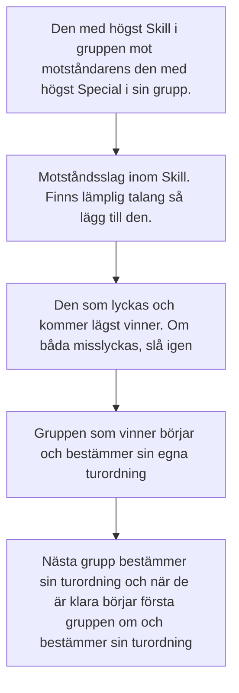
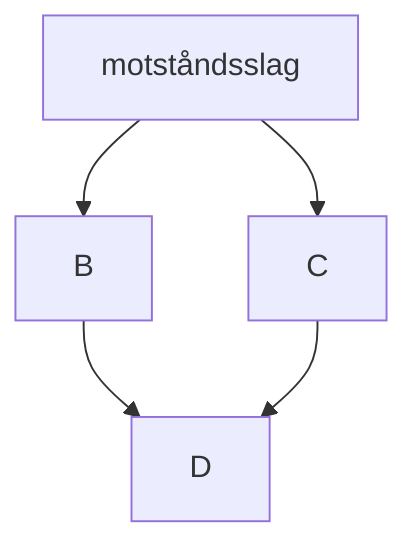

Lathund för initiativ

```mermaid
graph TD;
    A[Den med högst Skill i gruppen mot motståndarens den med högst Special i sin grupp.] -->B[Motståndsslag inom Skill. Finns lämplig talang så lägg till den.] -->C[Den som lyckas och kommer lägst vinner. Om båda misslyckas, slå igen] --> D[Gruppen som vinner börjar och bestämmer sin egna turordning] --> E[Nästa grupp bestämmer sin turordning och när de är klara börjar första gruppen om och bestämmer sin turordning]

```
Lathund för strid

```mermaid
graph TD;
    A[motståndsslag]-->B;
    A-->C;
    B-->D;
    C-->D;
```
