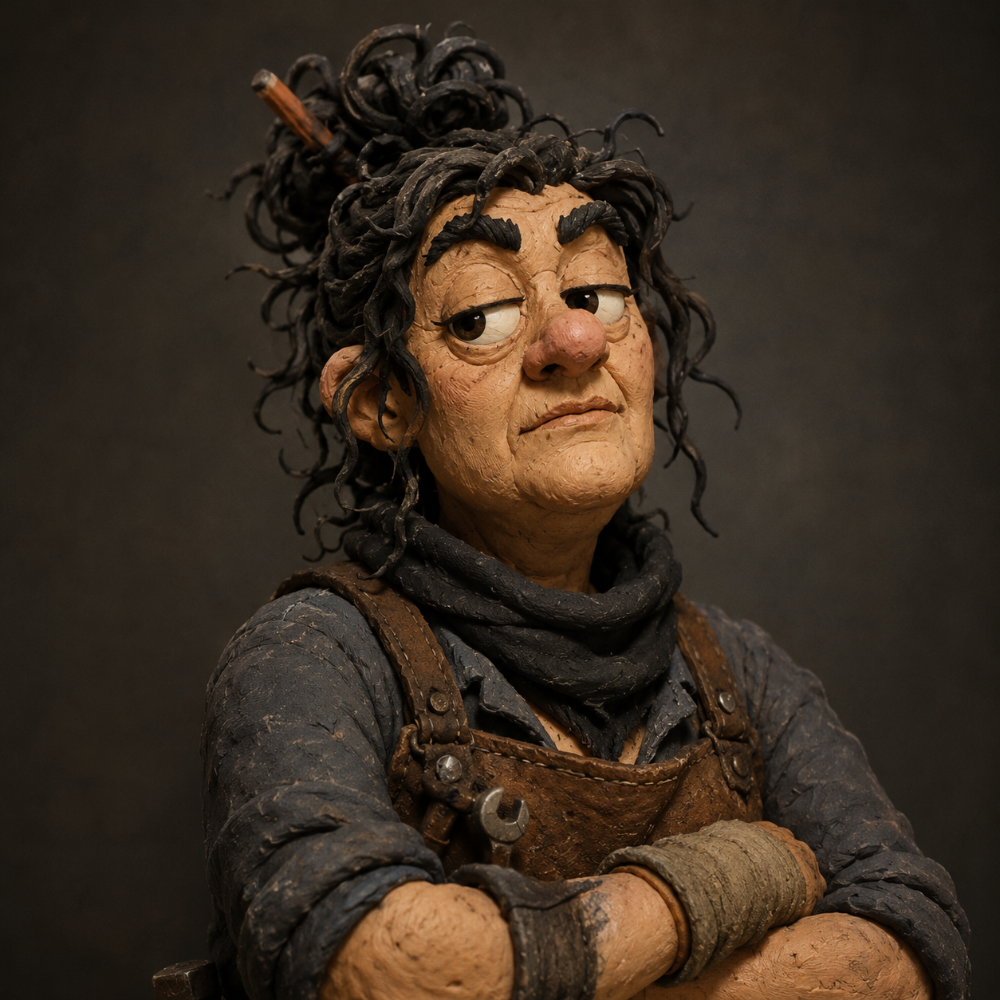
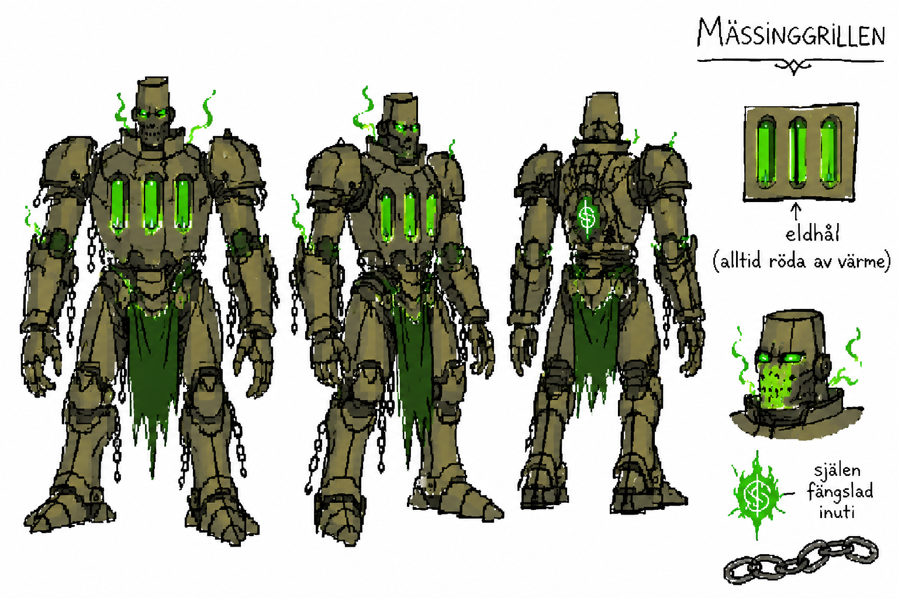

# Hook
Gruppen blir attackerade med bakhåll av några mutant vägbanditer, när de vakar som vakter åt köpmanna gillet. Detta pick och pack fraktade okända varor. Gruppen får extra betalt för att de inte vet något.

# Vad händer egentligen?

Big Bad Boss Mässingsgrillen vill få inflytande i regionen och gottgöra för en förlust åt Ruttna Slavarinnans 

1. De muterade vägbanditerna är här bara för bytet.
2. De är 3 gånger fler än er och skadar er mer än gärna.
3. De lyckas ta bytet med sig och ni får extra i uppdrag att jaga efter dem. De lyckas få ett försprång då de lyckas skaka av er först vid en klippa, sedan vid ett dike med små båtar, sist försöker de med att lämna kvar kupaner för att skynda iväg.

Spåren är tydliga därför de inte brytt sig om att dölja dem. Men gissningsvis är de påväg till en vaktposten *Långt borta* som tillhör borg som tidigare varit en plats för den Ruttna Slavarinnan, men nu styrs den av alliansen mot mörkret. Resan dit leder mellan en förmörkade cirkeln. Man kan välja att gå runt men igenom är snabbast.

# Om ingen ingriper

# Viktiga personer




```
Namn: Kerstin Stenplatta

Yrke: Exo-jägare

Distinktion Need Agenda: Är en notorisk lögnare / Behöver hjälp att bygga något / Är utskickad för att testa hjältar

```
General till Ruttna Slavarinnan försöker öka hennes inflytande. *Mässingsgrillen* har länge försökt komma över ett misstag när han förlorade en look-out point och tog tillbaka hennes domän några steg. *Mässingsgrillen* vill skapa en katastrof som både övertar ett försvagat område och skapar slavar till henne. (lite som Sylora Salm i Neverwinter Sage)


```

Mässingsgrillen är en animerad humanoid med brödrost hål på magen som kan spruta eld. Hans själ är tvådelad, dels en ond ande och en människa, som tryckts in i en konstruktion.


```
---
# Platser

## Förmörkade cirkeln
Roamar fiender utan dess like. Många affilierar till Ruttna Slavarinnan. Detta är en helgedom för många onda satar.

---
## Långt borta

---

# Slumphändelser

# Belöningar
